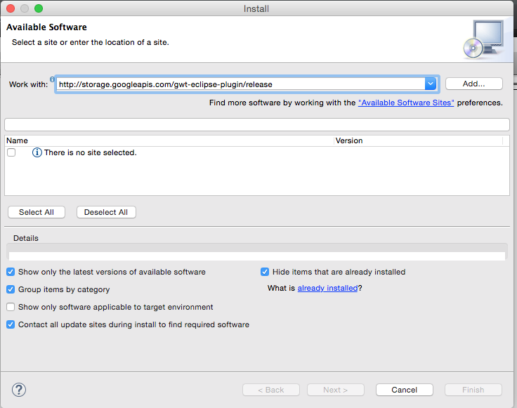
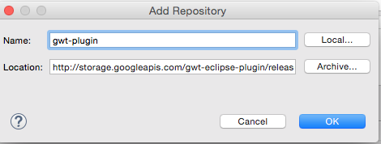
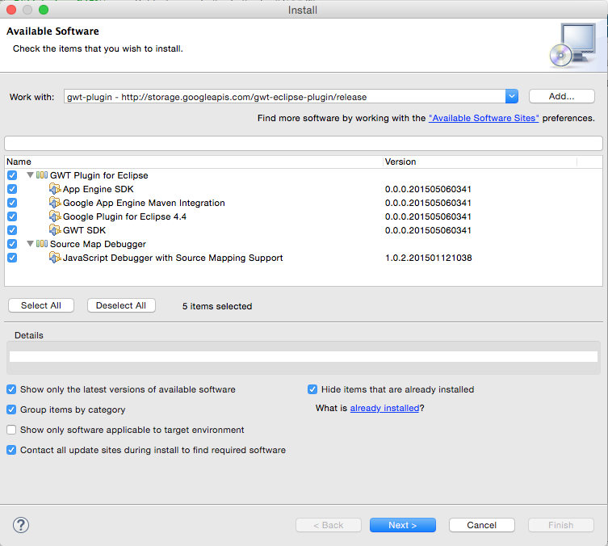

# Download
Download the GWT Eclipse Plugin

## Warning - Do not install this with your current installation
The current release is a preview, which means try at your own peril.
It is recommended at this time to install this in a clean Eclipse install.  

## Available Features

* Google Plugin for Eclipse 4.4 (GWT Plugin)
* Google App Engine Maven Integration
* Java Script Debugger (SDBG) 
* GWT SDK - GWT 2.7.0
* App Engine SDK - Recent App Engine SDK

## Update Site

* [http://storage.googleapis.com/gwt-eclipse-plugin/release](http://storage.googleapis.com/gwt-eclipse-plugin/release)

## Installation

1. Copy the update site above.
2. Goto `Help` > `Install New Software`
3. Paste the `Update Site` into `Work with:` and click on `Add`
	
	

4. Name the `Update Site`

	

5. Select features to be installed

	