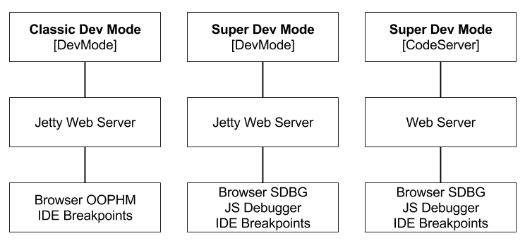

# Getting Started with Eclipse
Debugging GWT applications in Eclipse.

## Installing

* [GWT Eclipse Plugin Download and Install](./Download.html)

## Debugging GWT applications
It takes three parts to debug a GWT Application

1. Application
2. Server to run the application on
3. Connection to the browser for IDE integration for break points and logging

## Choosing a Dev Mode
In the past `Classic Dev Mode` was used to debug an applications. 
Now and into the future `Super Dev Mode` is used to debug applications.
These methods can be optional and can be configured differently.
 

## Which Dev Mode
There are many ways to debug the GWT application. 
In general there are two potential paths. 
The first is using DevMode entrypoint with the built in Jetty web server. 
The second is using the CodeServer entrypoint with a custom web server. 

The reason the CodeServer is a better choice, it has the launcherDir flag and allows for easier Super Dev Mode adjustments with its flags. 

### Dev Mode

* [More on using DevMode](./devmodes/DevMode.html)

### Code Server

* [More on using the CodeServer](./devmodes/SuperDevMode.html)
