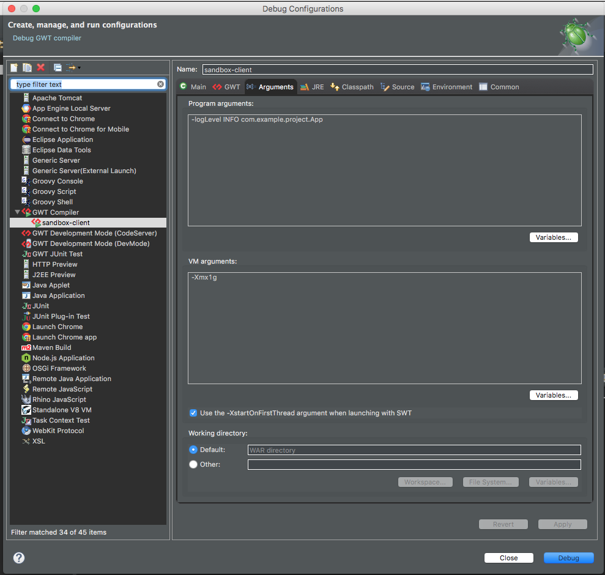

# GWT Compiler
This covers using the new GWT Compiler launcher. 

## Reference

* [Launcher Options](../../gwt/launchers/Compiler.html)

## Compiler

Using it is best described in this video.
<iframe width="560" height="315" src="//www.youtube.com/embed/3hsDunjiVmQ" frameborder="0" allowfullscreen></iframe>

## Creating
Creating a compiler can be done by clicking on the project shortcut.

## Editing
Editing a compiler dialog by going to Debug Configurations.

