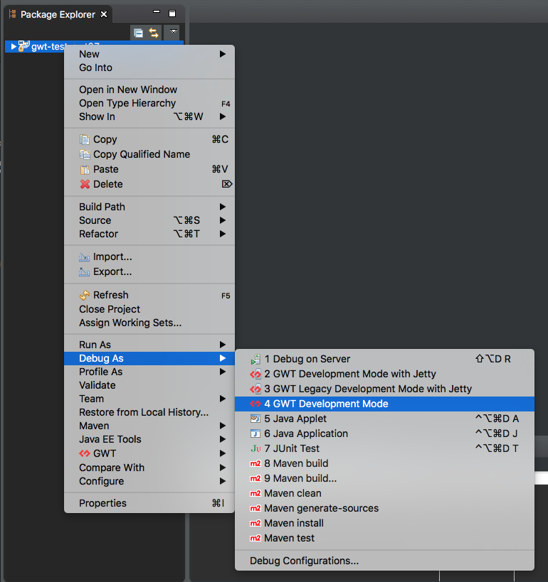

# GWT Development Mode (Using the CodeServer Launcher)
Using this Development Mode will start a code server that listens for requests from the browser to compile the application.
When the `CodeServer` launches and moves the resources to the module directory. 
Then it adds a war/module/module.nocache.js super dev mode initialization script to which will launch the compile request to the CodeServer.

* The code server does not have a built in Jetty web server like [DevMode](./DevMode.html) does.

## Reference

* [CodeServer Program Arguments Reference](../../gwt/launchers/CodeServer.html)

### Use launcherDir
Use the `-launcherDir output/to/warDir` to direct the compiler to put the output the resources and module/module.nocache.js in the war directory. 
This prevents from having to use the bookmarklets.

### Verify Launch
If you want to verify that the code server launched and pushed the resources into the directory. 
Go into your war output directory specified in the `-launcherDir` and find module/module.nocache.js and find super development mode. 
If you find super development mode anywhere in the file it did it's job. 
Launching will start a the compilation of the application.

## Launching
Create and reuse a launcher by right clicking on the project and going to the `Debug As` and then to `GWT Development Mode`.

