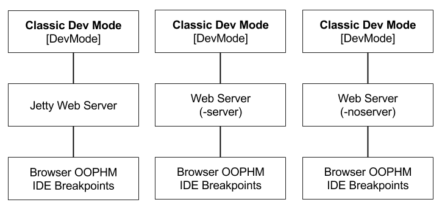

# Classic Dev Mode
Classic Dev Mode is used to launch a process which compiles the application, 
run a web server and uses a process OOHPM to connect to the browser. 

The OOPHM process is no longer supported in the modern browsers.

DevMode can also run Super Dev Mode with a flag.  

## Reference

* [DevMode Guide](http://www.gwtproject.org/doc/latest/DevGuideCompilingAndDebugging.html)

## Options

* GWT 2.6.1

		DevMode [-[no]startServer] [-port port-number | "auto"] [-whitelist whitelist-string] [-blacklist blacklist-string] [-logdir directory] [-logLevel level] [-gen dir] [-bindAddress host-name-or-address] [-codeServerPort port-number | "auto"] [-server servletContainerLauncher[:args]] [-startupUrl url] [-war dir] [-deploy dir] [-extra dir] [-workDir dir] [-sourceLevel [auto, 1.6, 1.7]] module[s] 
		
		  -[no]startServer  Starts a servlet container serving the directory specified by the -war flag. (defaults to ON)
		  -port             Specifies the TCP port for the embedded web server (defaults to 8888)
		  -whitelist        Allows the user to browse URLs that match the specified regexes (comma or space separated)
		  -blacklist        Prevents the user browsing URLs that match the specified regexes (comma or space separated)
		  -logdir           Logs to a file in the given directory, as well as graphically
		  -logLevel         The level of logging detail: ERROR, WARN, INFO, TRACE, DEBUG, SPAM, or ALL
		  -gen              Debugging: causes normally-transient generated types to be saved in the specified directory
		  -bindAddress      Specifies the bind address for the code server and web server (defaults to 127.0.0.1)
		  -codeServerPort   Specifies the TCP port for the code server (defaults to 9997)
		  -server           Specify a different embedded web server to run (must implement ServletContainerLauncher)
		  -startupUrl       Automatically launches the specified URL
		  -war              The directory into which deployable output files will be written (defaults to 'war')
		  -deploy           The directory into which deployable but not servable output files will be written (defaults to 'WEB-INF/deploy' under the -war directory/jar, and may be the same as the -extra directory/jar)
		  -extra            The directory into which extra files, not intended for deployment, will be written
		  -workDir          The compiler's working directory for internal use (must be writeable; defaults to a system temp dir)
		  -sourceLevel      Specifies Java source level (defaults to auto:1.7)
		and 
		  module[s]         Specifies the name(s) of the module(s) to host

### bindAddress
Use the `-bindAddress 0.0.0.0` to bind on every IP.

## Launching Classic Dev Modes
There are several ways that DevMode can be used.

1. Run the classic DevMode which uses an internal Jetty process to host the application.
2. Run the classic DevMode which uses `-server` to which runs an external server like App Engine.
3. Run the classic DevMode with out a server using `-noserver` and specify the server. 

###1. Launching DevMode with Jetty

###2. Launching DevMode with a -server

TODO add steps

###3. Launching DevMode with a -noserver

TODO add steps