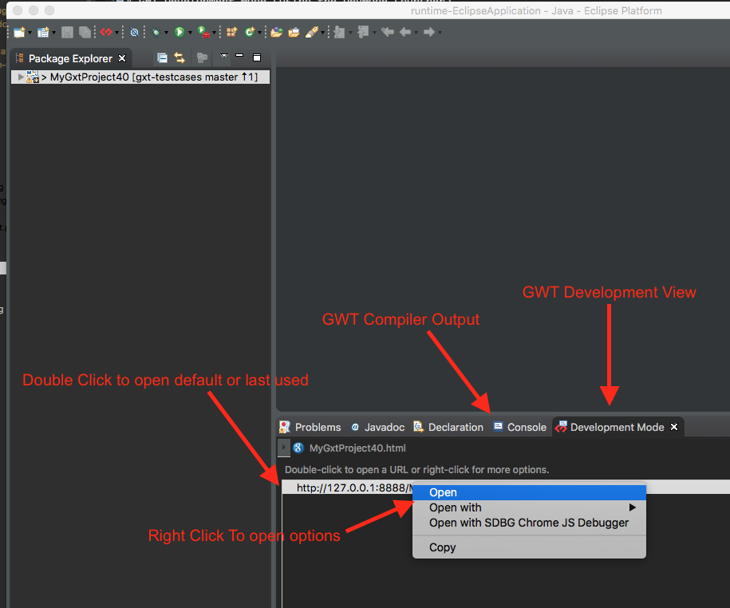
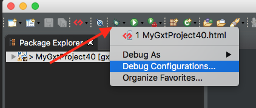

# GWT Development Mode (Using the DevMode Launcher)
Using GWT Development Mode will launch the `CodeServer` and a embedded Jetty web server by default.
There will start two servers, the first being the Jetty web server and the CodeServer which will listen 
for compile requests from the browser.      

* DevMode will run the Super DevMode `CodeServer` by default in GWT 2.7.0+.
* Mobile debugging uses the web server on the device.

## Reference

* [DevMode Program Arguments Reference](../../gwt/launchers/DevMode.html)

### war Argument
Use the `-war output/to/warDir` to direct the compiler to put the output in the war directory. 
This argument is sent to the -launcherDir in the CodeServer.
This prevents from having to use the bookmarklets.

### bindAddress Argument
Use the `-bindAddress 0.0.0.0` to bind on every IP address.

## Launching
Create and reuse a launcher by right clicking on the project and going to the `Debug As` and then to `GWT Development Mode with Jetty`.
Once started the compiler will ouput into the console then open GWT Development View with links to open the browser.

First create a launcher by right clicking on the project and going to `GWT Development Mode with Jetty`.

Then open the browser by right clicking on URL

### Changing Program Arguments
After a launcher has been created you can change the arguments. 
Goto the `Debug Configurations` and choose the `GWT Development Mode (DevMode)` launcher configuration.

* Find the available program arguments here: [DevMode Arguments](../../gwt/launchers/DevMode.html)

First choose the `Debug Configurations`

Then choose the `GWT Development Mode (DevMode)` and then choose the launcher created.
