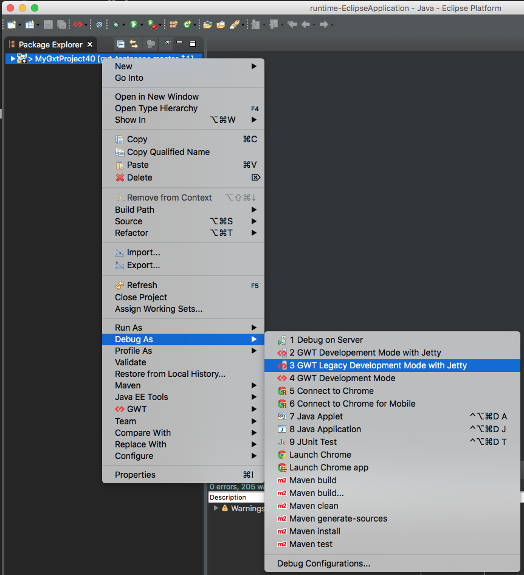

# Legacy Development Mode (a.k.a. Classic Development Mode)
Legacy Development Mode is used to launch a process which compiles the application, 
runs a web server and uses a process OOHPM to connect to the browser. 
The OOPHM process is no longer supported in the modern browsers.

* The `DevMode` launcher will run the Super DevMode CodeServer by default in GWT 2.7.0+ and to turn on Legacy dev mode use `-nosuperDevMode`.
* The legacy `DevMode` launcher will create a program argument "-nosuperDevMode" in GWT 2.7.0+.   

## Reference

* [DevMode Program Arguments Reference](../../gwt/launchers/DevMode.html)

### bindAddress
Use `-bindAddress 0.0.0.0` to bind the web server to every available host ip address.

## Launching
Create and reuse a launcher by right clicking on the project and going to the `Debug As` and then to `GWT Legacy Development Mode with Jetty`.

