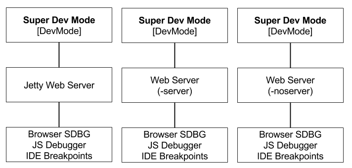

# Super Dev Mode using DevMode
Use DevMode to start the CodeServer which is Super DevMode.

## Reference

* [Super Dev Mode Guide](http://www.gwtproject.org/articles/superdevmode.html)

## Launching Super Dev Mode

### Launching Super Dev Mode 
Launching Super Dev Mode using DevMode.
  

### Launching -server
TODO add steps

### Launching -noserver 
TODO add steps

