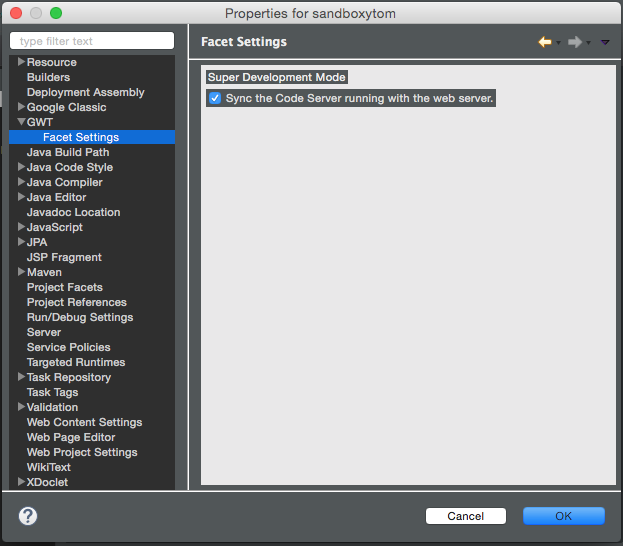

# Project Facets
Eclipse Project facets are used to give Projects different behaviors.

## GWT Facet
The GWT facet enables GWT to be used with Eclipse WTP Server Runtimes.

The project has facet settings that can be set in `Project > Properties > GWT > Facet Settings`. 

  

* Sync the Code Server Running with the Web Server - This automatically will launch the SDM code server when the server runtime is started.

## Dynamic Web Mode
The Dynamic Web Module provides the ability to run the application with a server runtime like Tomcat or App Engine.

